# 吴恩达机器学习笔记

# 1.机器学习

## 定义

eg：跳棋程序

- E： 程序自身下的上万盘棋局
- T： 下跳棋
- P： 与新对手下跳棋时赢的概率

计算机程序从经验 E 中学习，解决某一任务`T`，进行某一性能`P`，通过`P`测定在`T`上的表现因经验`E`而提高

## 分类

- **有监督的学习**利用经验(历史数据)，学习表示事物的模型，关注利用模型预测未来数据。给算法一个数据集，其中包含了正确答案，算法的目的是给出更多的正确答案。
  **分类问题(Classification)**和**回归问题(Regression)。**
  1. 分类问题是对事物所属类别的判别，类型的数量是已知的。例如，识别鸟，根据鸟的身长、各部分羽毛的颜色、翅膀的大小等多种特征来确定其种类；垃圾邮件判别，根据邮箱的发件、收件人、标题、内容关键字、附件、时间等特征决定是否为垃圾邮件。
  2. 回归问题的预测目标是连续变量。例如，根据父、母的身高预测孩子的身高；根据企业的各项财务指标预测其资产收益率。
- **无监督的学习**倾向于对事物本身特性的分析，只给算法一个数据集，但是**不给数据集的正确答案**，由算法自行分类。
  **数据降维(Dimensionality Reduction)**和**聚类问题(Clustering)**。 1. 数据降维是对描述事物的特征数量进行压缩的方法。例如，描述学生，记录了每个人的性别、身高、体重、选修课程、技能、业余爱好、购物习惯等特征。面向特定的分析目标职业生涯规划，只需选取与之相关的特征进行分析，去掉无关数据，降低处理的复杂度。 2. 聚类问题的目标也是将事物划分成不同的类别，与分类问题的不同之处是事先并不知道类别的数量，它根据事物之间的相似性，将相似的事物归为一簇。例如，电子商务网站对客户群的划分，将具有类似背景与购买习惯的用户视为异类，即可有针对性地投放广告。

# **2.单变量的线性回归 univariate linear regression——预测问题**

## 2.1 单变量线性函数

**假设函数(Hypothesis)**

$h_{\theta}(x) = \theta_0 + \theta_1x$
其中$\theta_0$是模型的参数，$x$是输入变量/特征，y 是输出变量/目标变量。

**代价函数(cost function)**

平方误差函数或者平方误差代价函数，它的作用是为我们的训练样本(x,y)选择一个合适的模型参数$\theta_0$和$\theta_1$，使得$h_{\theta}(x)$与真实值$y$之间的差距最小。
$$ J(\theta*0, \theta_1) = \frac{1}{2m} \sum*{i=1}^m (h\_{\theta}(x^{(i)}) - y^{(i)})^2 $$
其中$m$是训练集的大小，我们的目标是找到使得$J(\theta_0, \theta_1)$最小的$\theta_0$和$\theta_1$。

$$min_{\theta_0, \theta_1} J(\theta_0, \theta_1)$$

推导可得$\theta_{0}, \theta_{1}$的更新公式：

$$\theta_0 := \theta_0 - \alpha \frac{1}{m} \sum_{i=1}^m (h_{\theta}(x^{(i)}) - y^{(i)})$$

$$\theta_1 := \theta_1 - \alpha \frac{1}{m} \sum_{i=1}^m (h_{\theta}(x^{(i)}) - y^{(i)}) x^{(i)}$$

**梯度下降法(Gradient descent)**

用来求函数极小值的算法，将使用梯度下降算法来求出代价函数$J(\theta_0, \theta_1)$的最小值。但当选择不同的初始参数组合，可能会找到不同的局部最小值。

Repeat until convergence {$\theta_j := \theta_j - \alpha \frac{\partial}{\partial \theta_j} J(\theta_0, \theta_1)  \quad (for\quad j = 0, 1)$ }

其中$\alpha$是学习率(learning rate)，用来控制梯度下降时更新的步长。即$\alpha$越大则说明梯度下降会很迅速；反之则会减慢更新的速度。同时更新(Simultaneous update)$\theta_0$和$\theta_1$。

梯度下降的缺点：

1.只能知道导数方向，不知道与最优点的距离；

2.不能保证全局最优性。

## 2.2 多变量线性回归

**多维特征**

假设函数$h_0(x) = \theta_0 + \theta_1x_1 + \theta_2x_2  +...+ \theta_{n}x_{n} =\theta^TX$，其中$\theta$是模型的参数向量，$x_i$是第$i$个特征，$n$是特征的个数。

Hypothesis ：$h_0(x) = \theta_0 + \theta_1x_1 + \theta_2x_2  +...+ \theta_{n}x_{n}$

Parameters : $\theta = (\theta_0, \theta_1, \theta_2,..., \theta_{n})$

Cost function：$J(\theta) = \frac{1}{2m} \sum_{i=1}^m (h_0(x^{(i)}) - y^{(i)})^2$

Gradient descent: Repeat{ $\theta_j := \theta_j - \alpha \frac{\partial}{\partial \theta_j} J(\theta)$ }

New algorithm:Repeat{ $\theta_j := \theta_j - \alpha \frac{1}{m} \sum_{i=1}^m (h_0(x^{(i)}) - y^{(i)}) x_j^{(i)}$ }

**特征缩放(Feature scaling)**
是为了确保特征在一个相近的范围内, 使得算法更快收敛。可以使用均值归一化的方法实现特征缩放

**均值归一化**：$x_n = \frac{x_n - \mu_n}{s_n}$，其中$\mu_n$是平均值，$S_n$是标准差。

**学习率**
梯度下降算法收敛所需要的迭代次数根据模型的不同而不同，我们可以通过绘制迭代次数和代价 函数的图来观察算法在何时趋于收敛。如果在一次迭代中, $J(\theta)<\frac{10^{-3}}\epsilon{}$, 则说明算法已经收敛。学习率$\alpha$的选择不能过大或过小，过大导致算法无法收敛，过小导致算法收敛速度过慢，可以尝试 0.001,0.003,0.01,0.03,0.1,0.3,1...等。

**特征和多项式回归**

多项式回归可以用线性回归的方式来拟合，非常复杂的函数，甚至是非线性函数都可以。
假设函数：
$\small{h_0(x) = \theta_0 + \theta_1x_1 + \theta_2x_2 +\theta_3x_3=\theta+\theta_1(feature)+\theta_2(feature)^2+\theta_3(feature)^3}$

**正规方程**

正规方程(Normal Equation)是一种求 $\theta$ 的方法，它是通过求解$\frac{\partial}{\partial \theta} J(\theta)=0$来找出使得代价函数最小的参数的$\theta$不需要进行特征缩放。使用正规方程解出$\theta=(X^TX)^{-1}X^Ty$后，可以直接预测新数据。
而正规方程的推导公式如下：

$J(\theta) = \frac{1}{2m} \sum_{i=1}^m (h_0(x^{(i)}) - y^{(i)})^2$

将上式转化为矩阵表达形式：$J\theta = \frac{1}{2}(X\theta - y)^T(X\theta - y)=\frac{1}{2}(X^T\theta^T - y^T)(X\theta - y) = \frac{1}{2}\theta^TX^TX\theta - \frac{1}{2}\theta^TX^Ty - \frac{1}{2}y^TX\theta + \frac{1}{2}y^Ty$

接下来对$J(\theta)$求偏导（提示$\frac{\partial(AB)}{\partial A}=B^T$,$\frac{\partial X^TAX}{\partial X}=2AX$）：

$\frac{\partial}{\partial \theta_j} J(\theta) = \frac{\partial}{\partial \theta_j} \frac{1}{2}\theta^TX^TX\theta - \frac{\partial}{\partial \theta_j} \frac{1}{2}\theta^TX^Ty - \frac{\partial}{\partial \theta_j} \frac{1}{2}y^TX\theta + \frac{\partial}{\partial \theta_j} \frac{1}{2}y^Ty$

| **梯度下降**                  | **正规方程**                                    |
| ----------------------------- | ----------------------------------------------- |
| 需要选择 α                    | 不需要选择 α                                    |
| 需要多次迭代                  | 一次运算得出                                    |
| 当特征数量 n 大时也能较好适用 | 需要计算$(X^TX)^{-1}$, 当特征数量 n 大时会很慢  |
| 适应于各种类型的模型          | 只适用于线性模型，不适合 Logisic 回归等其他模型 |

# Logisitic 回归

**定义**：是一种分类方法，可以适用于二分类问题，也可以适用于多分类问题，但是二分类的更为常用，也更加容易解释。实际中最为常用的就是二分类的 logistic 回归，常用于数据挖掘，疾病自动诊断，经济预测等领域。

用于两分类问题。其基本思想为：

- 寻找合适的假设函数，即分类函数，用以预测输入数据的判断结果；
- 构造代价函数，即损失函数，用以表示预测的输出结果与训练数据的实际类别之间的偏差；
- 最小化代价函数，从而获取最优的模型参数。

## 分类问题

讨论的是要预测的变量 y 是一个离散情况下的分类问题。
分类问题中，我们尝试预测的是结果是否属于某一个类。分类问题的例子有：判断一封电子邮件是否是垃圾邮件; 判断一次金融交易是否是欺计；判断一个肿瘤是恶性的还是良性的。

我们预测的变量$y \in\{0,1\}$，其中$0$表示负类，$1$表示正类。输出值永远在 0 到 1 之间。
不推荐将线性回归用于分类问题，线性回归模型的预测值可超越[0,1]范围。

## 假设表示

对于分类问题, 我们需要输出 0 或 1，我们可以预测:

- 当$h_{\theta}(x) \leqslant 0.5$时, 预测$y=0$;
- 当$h_{\theta}(x) \geqslant 0.5$时, 预测$y=1$。

Logistic 回归模型的假设函数是 $h_\theta(x)=g(\theta^Tx)$, 其中$g(z)=\frac{1}{1+e^{-z}}$又称为 sigmoid 函数（Sigmoid function）, $X$代表输入特征向量，$\theta$代表模型参数向量。
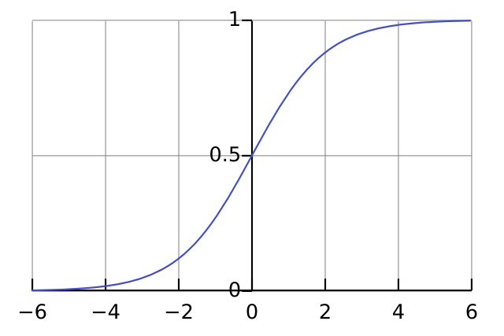

**目的**：对于给定的输入变量 $x$, 预测其对应的输出变量 $y=1$的可能性(estimated probablity), 即$P(y=1|x;\theta)$。所以$P(y=0|x;\theta)+P(y=1|x;\theta)=1$。

## 决策边界

决策边界分为线性决策边界 (Linear decision boundary) 和非线性决策边界 (Non-linear decision boundary)。
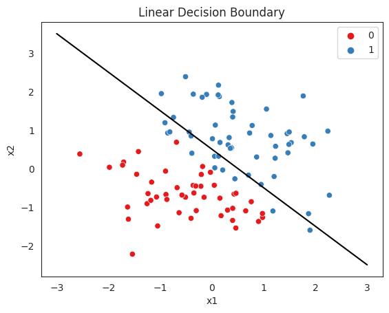
上图为线性决策边界，其中蓝色代表正类，红色代表负类。其中参数$\theta=[-3,1,1]$决定了分类的边界。当$x_1+x_2>=3$，模型将预测 y=1。
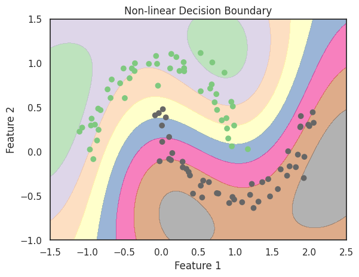
上图为非线性决策边界的例子。

## 代价函数

定义损失函数为：
$$J(\theta)=-\frac{1}{m}\sum_{i=1}^mCost(h_\theta(x^{(i)}),y^{(i)}))$$

其中 $Cost(h_\theta(x^{(i)}),y^{(i)}) =\begin{cases}
    -log(h_\theta(x)) & \text{if } y=1\\
    -log(1-h_\theta(x)) & \text{if }y=0
\end{cases}$
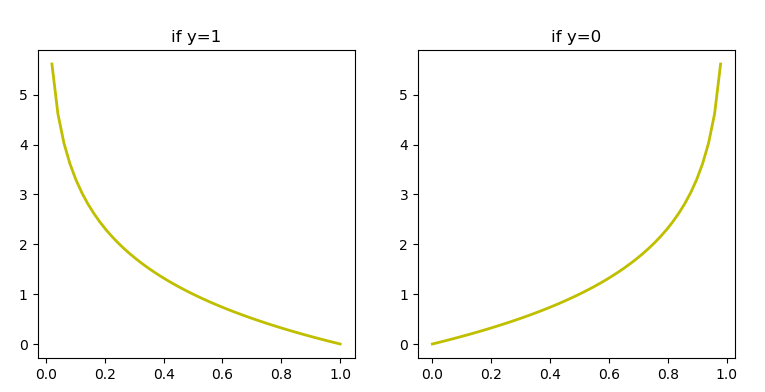
函数特点：

- 当实际的 y = 0 且预测的$h_\theta(x)=0$时，误差会随$h_\theta(x)$变大而变大；
- 当实际的 y = 1 且预测的$h_\theta(x)=1$时，误差会随$h_\theta(x)$变小而变大。

Logisitic 回归的代价函数为：
$$J(\theta)=-\frac{1}{m}\sum_{i=1}^m[y^{(i)}\log(h_\theta(x^{(i)}))+(1-y^{(i)})\log(1-h_\theta(x^{(i)}))]$$

## 梯度下降

为了拟合出参数, 我们需要最小化代价函数, 找到$\min{J(\theta)}$对应的参数$\theta$。所用的方法是梯度下降法。

Repeat{$\theta_j := \theta_j - \alpha \frac{1}{m}\sum_{i=1}^m[h_\theta(x^{(i)})-y^{(i)})x_j^{(i)}]$}

## 高级优化

一些更高级的优化算法有：共轭梯度法、BFGS 和 L-BFGS 等。

**优点**：一个是通常不需要手动选择学习率，它们有一个智能内循环（线性搜索算法），可以自动尝试不同的学习速率$\alpha$并自动选择一个好的学习速率，它们甚至可以为每次迭代选择不同的学习速率，那么我们就不需要自己选择。还有一个是它们经常快于梯度下降算法。

**缺点**：过于复杂

## 多类别分类

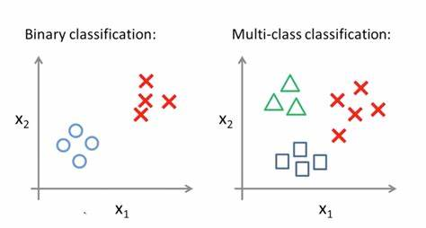
用 3 种不同的符号来代表 3 个类别，可以使用"一对多"方法来进行分类。现在我们有一个下图所示的训练集，共有 3 个类别，我们用三角形表示 y=1，方框表示 y= 2，叉表示 y = 3。我们下面要做的就是使用一个训练集，将其分成 3 个二元分类问题。
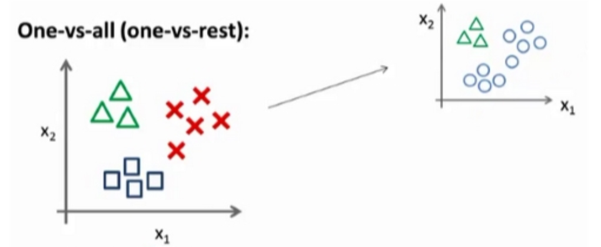
为了能实现这样的转变:

- 我们将多个类别中的一个类标记为正类 (y = 1) , 然后将其他所有类都标记为负类,这个模型记作$h^1_\theta(x)$。
- 接着, 类似地第我们选择另一个类标记为正类 ( y = 2 ), 再将其它类都标记为负类, 将这个模型记作$h^2_\theta(x)$。
- 最后，将所有的分类机都运行一遍, 然后对每一个输入变量，都选择可能性最高的输出变量。 在分类时，我们要做的就是训练这个逻辑回归分类器 $h^i_\theta(x)$，其中对应每一个可能的 y=i 。为了做出预测，我们给出输入一 个新的 x 值,我们要做的就是在我们三个分类器里面输入 x，然后我们选择一个让$h^i_\theta(x)$最大的 i 作为输出。

# 正则化

机器学习中的正则化是一种为了减小测试误差的行为。我们搭建机器学习模型时，最终目的是让模型在面对新数据的时候，可以有很好的表现。当用比较复杂的模型（比如神经网络）去拟合数据时，很容易出现**过拟合**现象，这会导致模型的泛化能力下降，这时候我们就需要使用正则化技术去降低模型的复杂度，从而改变模型的拟合度。

## 过拟合问题

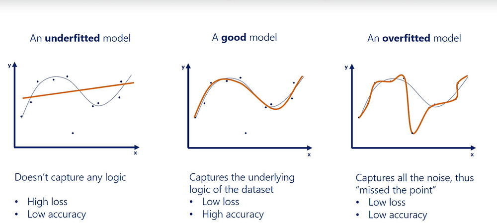
正则化可以改善或者减少过度拟合的问题。上图最右中，过于强调拟合原始数据，而丢失了算法的本质——预测新数据。若给出一个新的值让其预测，它将表现的很差，是过拟合(Overfitting)，虽然能非常好地适应我们的训练集但在新输入变量进行预测时可能会效果不好。

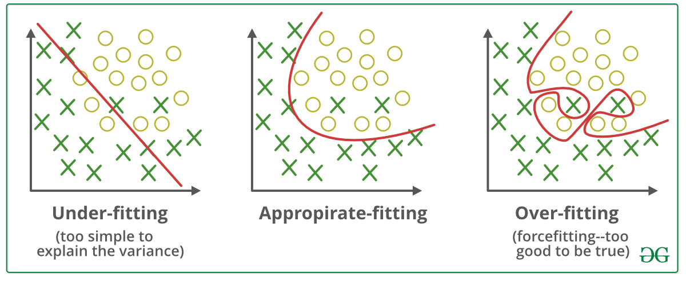
还有分类问题中也存在过拟合的情况。

过拟合的问题就是指当有非常多的特征，通过学习得到的模型能够非常好地适应训练集（代价函数可能几乎为 0），但是推广到新的数据集上效果会非常的差。
解决办法：

- 丢弃一些不能帮助我们正确预测的特征。可以是手工选择保留哪些特征，或者使用一些模型选择的算法来帮忙（例如 PCA）；
- 正则化。 保留所有的特征，但是减少参数的大小

## 代价函数

发生过拟合时，我们通过在代价函数中增加惩罚项来防止过拟合：

$$J(\theta)=\frac{1}{2m}[\sum_{i=1}^m(h_\theta(x^{(i)})-y^{(i)})^2+\lambda\sum_{j=1}^n\theta_j^2]$$
其中$\lambda$是正则化参数，它控制着模型的复杂度。根据惯例，我们不对$\theta_0$进行正则化，因为它代表的是截距项，对它进行正则化会导致欠拟合。

如果选择的正则化参数$\lambda$过大，则会把所有的参数都最小化了, 导致模型变成$h_\theta(x)=\theta_0$(图中红线)，造成欠拟合。

那为什么增加 $\lambda\sum_{j=1}^n\theta_j^2$可以让$\theta_j$的值变小呢？

因为如果令$\lambda$很大，为了让代价函数减小，那么就意味着让$\theta_j$的值也需要减小。因此 Too big lamda=>too small $\theta_j\approx 0$，这样只能得到一条平行于 x 轴的直线。所以对于正则化，我们要取一个合理的$\lambda$值。

## 线性回归的正则化

线性回归在代价函数最小时参数$\theta$的求解，一种基于梯度下降，一种基于正规方程。

- 基于梯度下降：
  Repeat{$\theta_j := \theta_j - \alpha \frac{1}{m}\sum_{i=1}^m(h_\theta(x^{(i)})-y^{(i)})x_j^{(i)}+\frac{\lambda}{m}\theta_j \quad for（ j=0,1,...,n）$}

  => $\theta_j := \theta_j(1-\frac{\alpha\lambda}{m}) - \alpha \frac{1}{m}\sum_{i=1}^m(h_\theta(x^{(i)})-y^{(i)})x_j^{(i)}$

  其中 $1-\frac{\alpha\lambda}{m}$ 是一个略小于 1 的数。当正则化线性回归时，我们要做的就是每次迭代时都将$\theta_j$乘以这个略小于 1 的数，每次把参数缩小一点。

- 基于正规方程：
  $$
  \theta = \left( X^T X + \lambda \begin{bmatrix}
  0  \\
  & 1  \\
   & &\ddots &\\
   & & &   1
  \end{bmatrix}\right)^{-1} X^T y
  $$

其中 $X = \begin{bmatrix}    (x^{(1)})^T \\    (x^{(2)})^T \\    \vdots \\    (x^{(m)})^T \end{bmatrix}$，$y = \begin{bmatrix}    y^{(1)} \\    y^{(2)} \\    \vdots \\    y^{(m)} \end{bmatrix}$。

## Logistic 回归的正则化

正则化 Logistic 回归的代价函数为
$$J(\theta)=-\frac{1}{m}\sum_{i=1}^m[y^{(i)}\log(h_\theta(x^{(i)}))+(1-y^{(i)})\log(1-h_\theta(x^{(i)}))] + \frac{\lambda}{2m}\sum_{j=1}^n\theta_j^2$$
同样，两种优化算法，梯度下降和高级优化算法。

Repeat until convergence{ $\theta_j := \theta_j(1-\frac{\alpha\lambda}{m}) - \alpha \frac{1}{m}\sum_{i=1}^m[h_\theta(x^{(i)})-y^{(i)})x_j^{(i)}+\frac{\lambda}{m}\theta_j] \quad for（ j=0,1,...,n）$}

其中$h_\theta(x)=g(\theta^Tx)$和线性回归的$h_\theta(x)$不同。

# 神经网络

神经网络是一种基于人工神经元网络的学习算法，它可以模拟人类的神经网络结构，并通过训练来解决复杂的分类、回归和预测问题。

人工神经网络（Artificial Neural Networks，简写为 ANNs）也简称为神经网络（NNs）或称连接模型（Connection Model），它是一种模仿动物神经网络行为特征进行分布式并行信息处理的算法数学模型。这种网络依靠系统的复杂程度，通过调整内部大量节点之间相互连接的关系，从而达到处理信息的目的。神经网络的分支和演进算法很多种，从著名的卷积神经网络 CNN，循环神经网络 RNN，再到对抗神经网络 GAN 等等。
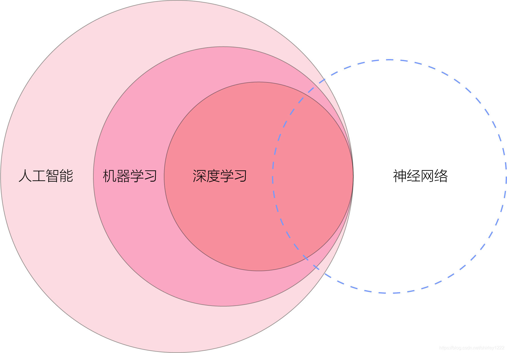

## 非线性分类

我们之前学的线性回归和 Logistic 回归都有这样一个缺点：当特征太多时，计算的负荷会非常大。下图中图 B 是非线性分类的例子
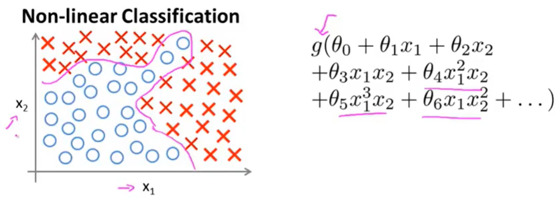
只要特征的阶数够高，可以尽可能符合分类要求，但当假设我们有非常多的特征时，例如有 100 个变量，那么计算的负荷就会非常大。即使我们只采用两两特征的组合，也会有接近 5000 个组合而成的特征，这对于一般的 Logistic 回归来说需要计算的特征太多了。

摄像头拍摄照片，像素点是特征值输入，一张照片是一个样本，多张照片是数据集。
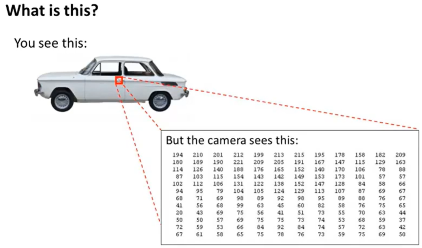
样本训练：这个样本集输入给学习算法，以训练出一个分类器，然后进行测试，即输入一张新的图片判断其是否为汽车。
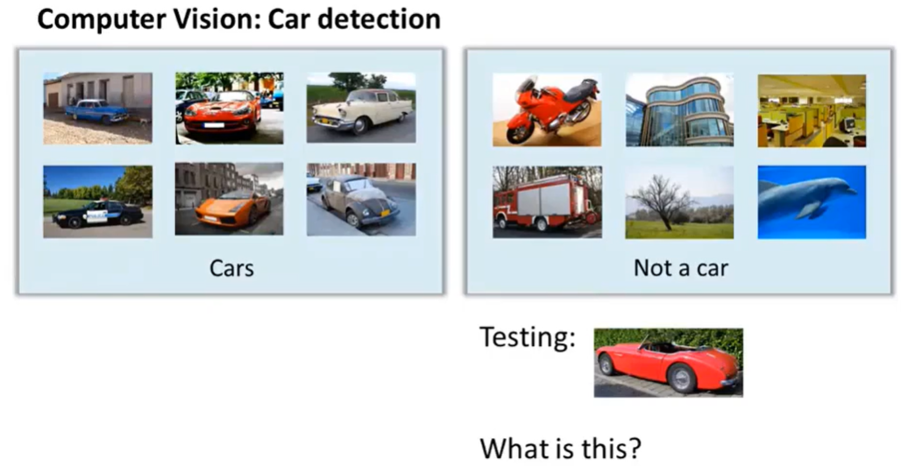
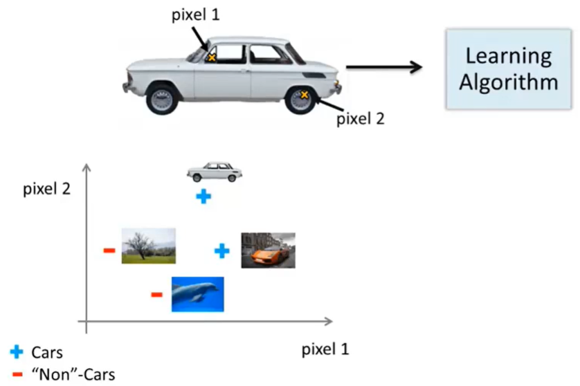
我们从图片中选择一组像素点（pixel1，pixel2），在坐标系中标出汽车的位置，汽车的位置取决于 pixel1 和 pixel2 的强度。接下来我们用同样的方法处理其他图片，依次将其他图片的位置标记到坐标系中（汽车用“+”标记，非汽车用“-”标记），我们可以发现汽车样本和非汽车样本分布在坐标系中的不同区域。

这个例子中特征空间维数是多少？假设我们用的是 50 × 50 像素的图片，并且我们将所有的像素视为特征，则会有 2500 个特征，如果我们要进一步将两两特征组合构成一个多项式模型，则会有约 $\frac{2500^2}{2}$ 个组合。这对于一般的 Logistic 回归来说是不可行的。

普通的 Logistic 回归模型不能有效地处理这么多的特征，这时候我们就需要神经网络来帮助我们处理输入特征 n 很大时的情况。

## 神经元和大脑

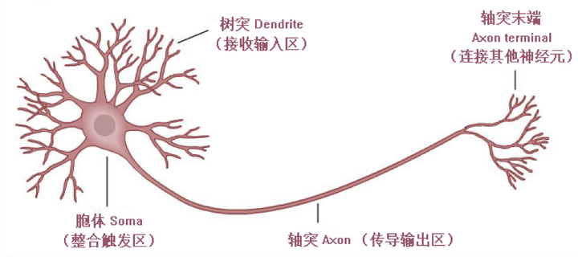
神经元是神经系统最基本的结构和功能单位，由三部分组成，分别是树突、胞体和轴突。

- 树突是接受输入，轴突是用于输出的。神经元的树突在接收到特定的输入刺激后，其胞体就会被激活，并通过轴突向其它神经元或神经元群输出兴奋，从而导致更多的神经元被激活，形成此起彼伏的神经元网络激活现象，而神经元间的有序激活就是产生我们的思维和行为的根本原因。
- 当我们想模拟大脑时，是指想制造出与人类大脑作用效果相同的机器。大脑可以学会用看而不是听的方式处理图像，学会处理我们的触觉，

## 模型表示 I

为了构建神经网络模型，我们需要首先思考大脑中的神经网络是怎样的？每一个神经元都可以被认为是一个处理单元/神经核（processing unit/Nucleus），它包含许多输入/树突（input/Dendrite），并且有一个输出/轴突（output/Axon）。神经网络是大量神经元相互连接并通过电脉冲来交流的一个网络。神经网络模型建立在很多神经元之上，每一个神经元又是一个个学习模型。这些神经元（也叫激活单元，activation unit）采纳一些特征作为输入，并且根据本身的模型提供一个输出。
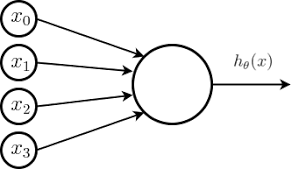

在神经网络中，参数又可被称为权重（weight）。其中$x_1$，$x_2$，...，$x_n$为输入单元，$h_\theta(x)=\frac{1}{1+e^{-\theta^Tx}}$为输出单元，即 Sigmoid 函数。继续设计出类似神经元的神经网络单元，我们可以得到多层神经网络。
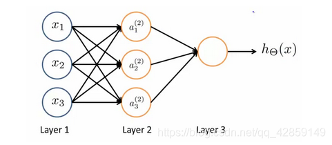

其中$x_1$，$x_2$，...，$x_n$为输入单元，$a_1$，$a_2$，...，$a_m$为隐藏层单元，它们负责将数据进行处理，然后呈递到下一层。 最后是输出单元，负责计算$h_\theta(x)$。我们为每一层都增加一个偏置单元（bias unit）：
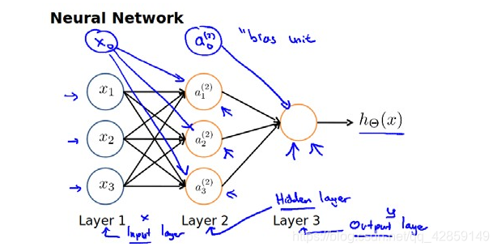

其中$a_i^j$表示第$j$层的第$i$个激活单元。$\theta_j$表示从第$j$层映射到第$j+1$层时的权重的矩阵，其尺寸由第 j+1 层的激活单元数量为行数，以第 j 层的激活单元数+1 为列数的矩阵。例如，上图的神经网络的尺寸时 3x4。

> 偏置单元（bias unit），在有些资料里也称为偏置项（bias term）或者截距项（intercept term），它其实就是函数的截距，与线性方程 y=wx+b 中的 b 的意义是一致的，b 表示函数在 y 轴上的截距，控制着函数偏离原点的距离，其实在神经网络中的偏置单元也是类似的作用。

激活单元的输出表达为：

$a_1^2=g(\theta_{10}^1x_0+\theta_{11}^1x_1+\theta_{12}^1x_2+\theta_{13}^1x_3)$

$a_2^2=g(\theta_{20}^1x_0+\theta_{21}^1x_1+\theta_{22}^1x_2+\theta_{23}^1x_3)$

$a_3^2=g(\theta_{30}^1x_0+\theta_{31}^1x_1+\theta_{32}^1x_2+\theta_{33}^1x_3)$

$h_\theta(x)=a_m^3=g(\theta_{m0}^2a_0^2+\theta_{m1}^2a_1^2+\theta_{m2}^2a_2^2+\theta_{m3}^2a_3^2)$

我们知道每一个 a 都是由上一层所有的 x 和每一个 x 所对应的权重 θ 决定的，我们把这样从左到右的算法称为前向传播算法( Forward Propagation)。

$x=\begin{bmatrix}x_0 \\x_1 \\x_2 \\  x_3 \\\end{bmatrix}$,
$\theta=\begin{bmatrix}
\theta_{10} & \theta_{11} & \theta_{12} & \theta_{13} \\
\theta_{20} & \theta_{21} & \theta_{22} & \theta_{23} \\
\theta_{30} & \theta_{31} & \theta_{32} & \theta_{33} \\
\end{bmatrix}$, $a=\begin{bmatrix}a_1\\a_2\\a_3\end{bmatrix}$

可以得到
$$\theta \cdot x =a$$

## 模型表示 II

相对于使用循环来编码，利用向量化的方法会使得计算更为简便。以上面的神经网络为例，试着计算第二层的值：
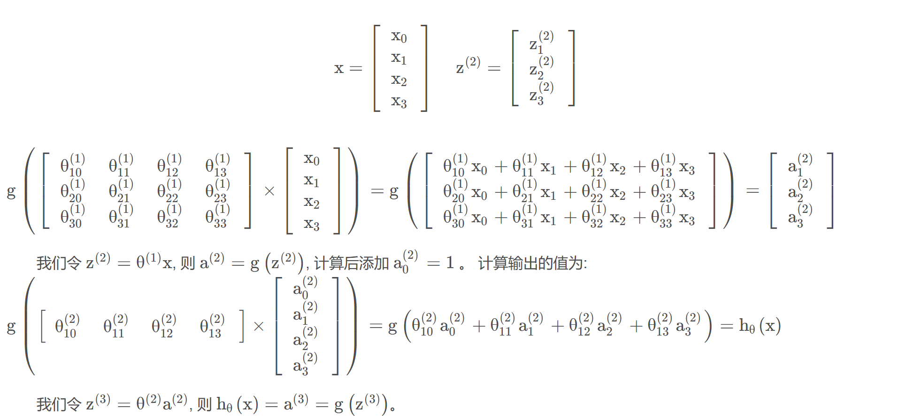

为了更好地了解神经网络的工作原理，我们先把左半部分遮住：
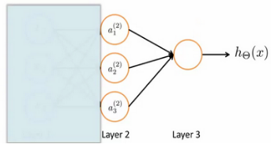

右半部分其实就是以$a_0,a_1,a_2,a_3$按照 Logistic 回归的方式输出$h_\theta(x)$。其实神经网络就像是 Logistic 回归，只不过我们把 Logistic 回归中的输入向量$x_i$换成了中间层$a_i$，我们可以把$a_i$看作更高级的特征值，因为是梯度下降的，所以 a 是变化的，并且变得越来越厉害，那么这些更高级的特征值远比仅仅将 x 次方厉害，也能更好的预测新数据。这就是神经网络相比于 Logistic 回归和线性回归的优势。

## 多类别分类

我们要训练一个神经网络算法来识别行人、汽车、摩托车和卡车，不同于之前识别汽车与非汽车的例子，这次在输出层我们应该有 4 个值，第一个值为 1 或 0 用于预测是否是行人，第二个值用于判断是否为汽车，第三个值用于判断是否为摩托车，第二个值用于判断是否为卡车。
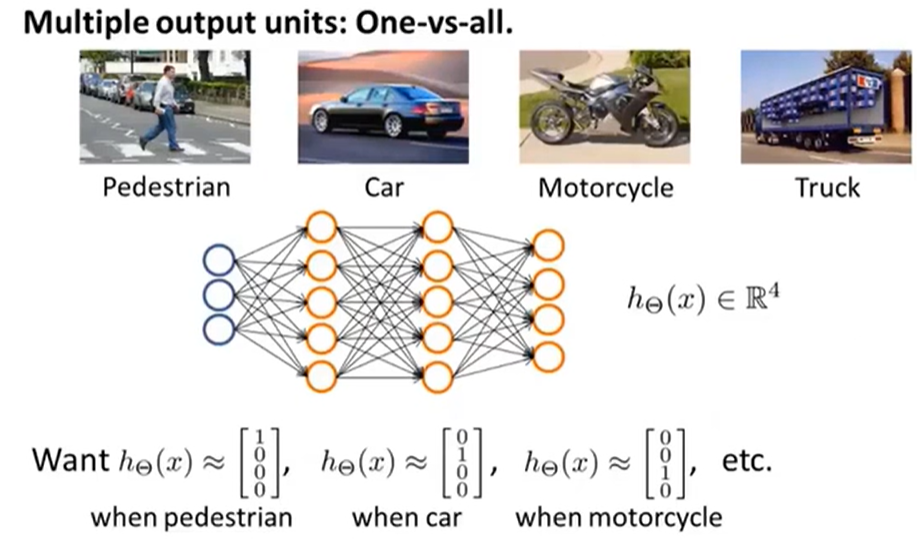
输入向量 x 的维度为 3，两个中间层，输出层有 4 个神经元分别用来表示 4 类，也就是每一个数据在输出层都会出现$[a,b,c,d]^T$，且 a,b,c,d 中仅有一个为 1，表示当前类。设定下的训练集的表示方式，区别于之前的输出 y 为一维数值，神经网络的多元输出是以多维向量形式表示
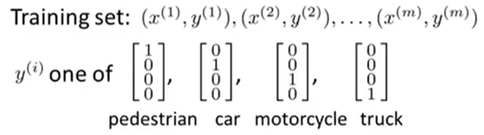

## 训练神经网络前准备
- **选择一种网络架构**：架构是指神经元之间的连接模式；
- **选择输入单元和输出单元的数量**：输入单元的数量为特征的维度，输出单元的数量为类别个数；
- **选择隐藏单元的数量**：合理的默认选项为单个隐藏层或者不止一个隐藏层，但通常都应有相同的单元数。如果有大量隐藏单元，计算量一般会比较大，但一般来说隐藏单元还是越多越好。并且一般来说每个隐藏层所包含的单元数量还应和输入x的维度相匹配，即和特征数量相匹配，隐藏单元的数量可以和输入特征数量相同，或者是它的二倍、三倍或四倍。因此，隐藏单元的数量和输入特征数相区配或者比特征数大几倍都是有效的。
  
**训练神经网络的步骤：**

- 随机初始化权重；
- 执行前向传播算法，对于该神经网络任意一个输入$x^{(i)}$，计算出对应的$h_\Theta(x^{(i)})$；
- 通过代码计算出代价函数$J(\Theta)$，代价函数衡量了神经网络的预测值与实际值之间的差距，越小越好；
- 执行反向传播算法来计算出这些偏导数$\frac{\partial J(\Theta)}{\partial
\Theta_{ij}^{(l)}}$。
  使用梯度检验来比较这些已经计算得到的偏导数项，把用反向传播得到的偏导数项值与用数值方法得到的估计值进行比较，然后停用梯度检验代码；
- 使用一个最优化算法，例如梯度下降算法或者更加高级的优化算法，将这些优化算法和反向传播算法相结合来最小化代价函数$J(\Theta)$。
  

对于神经网络来说，代价函数$J(\Theta)$是一个非凸函数，因此理论上可能停留在局部最小值的位置。代价函数$J(\Theta)$度量的就是这个神经网络对训练数据的拟合情况。反向传播算法能够让更复杂、强大、非线性的函数模型跟我们的数据很好的拟合。